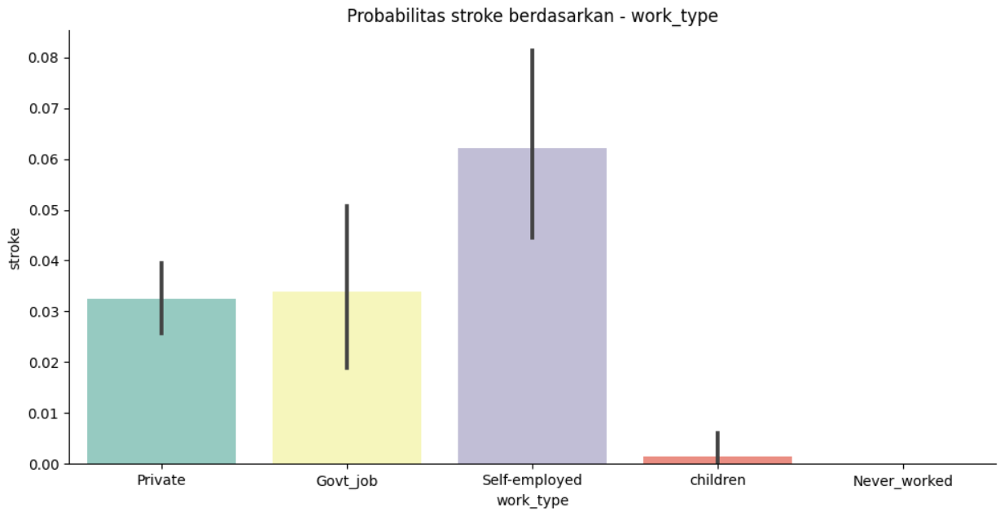

# Laporan Proyek Machine Learning - Alexander Gosal
## Domain Proyek
Stroke merupakan salah satu kondisi medis yang serius dan dapat mengancam jiwa, terjadi ketika suplai darah ke otak terganggu, baik karena adanya sumbatan pada pembuluh darah atau pecahnya pembuluh darah. Menurut *World Health Organization* (WHO), stroke adalah penyebab kematian ke-2 secara global, bertanggung jawab atas sekitar 11% dari total kematian. Menerapkan teknologi *machine learning* dalam bidang medis, seperti mengidentifikasi potensi stroke, dapat memiliki dampak yang signifikan dalam upaya pencegahan dan pengobatan lebih dini, yang pada gilirannya dapat meningkatkan tingkat kesembuhan dan kualitas hidup pasien. *Stroke Prediction Dataset* digunakan dalam proyek ini untuk memberikan informasi penting tentang pasien, termasuk faktor risiko seperti usia, jenis kelamin, tekanan darah, status perokok, status perkawinan, serta informasi medis lainnya. Data-data ini akan diolah dan dianalisis oleh model *machine learning* yang dibangun untuk menemukan pola-pola yang dapat membedakan antara pasien yang berpotensi mengalami stroke dengan yang tidak.

Seiring dengan berkembangnya teknologi, peran kecerdasan buatan atau yang dikenal dengan *Artificial Intelligence* (AI) di bidang kedokteran mulai berkembang sangat luas. Dalam pengaplikasiannya kita bisa memanfaatkan teknologi tersebut untuk mengadopsi proses dan cara berpikir manusia melalui sistem pakar. Sistem pakar ini merupakan program komputer yang dapat meniru proses pemikiran dan pengetahuan pakar untuk menyelesaikan suatu masalah. Dalam dunia kedokteran aplikasi sistem pakar tersebut bisa dimanfaatkan dalam membantu mendiagnosis penyakit-penyakit tertentu, termasuk dalam diagnosis jenis penyakit stroke. Sistem pakar banyak membantu penggunanya dalam memperoleh suatu keputusan akan penyakit serta memberikan solusi baik berupa himbauan, penatalaksanaan, dan juga terapi pengobatan yang sesuai. Masih kurangnya kesadaran serta pemahaman masyarakat terhadap gejala awal dan penanganan lebih dini terhadap penyakit ditambah keterbatasan jumlah tenaga dan peralatan medis mengakibatkan implementasi teknologi ini dipandang sebagai salah satu alternatif yang memudahkan tenaga medis dalam memprediksi prognosis dan melakukan diagnosis secara lebih cepat.

Peranan Artificial Intelligence (AI) dalam bidang kedokteran ini memiliki dampak yang sangat besar. Selain memudahkan dalam verifikasi data dan identifikasi gejala dari pasien secara cepat, penggunaan teknologi ini pun membantu mempermudah tenaga medis dalam melakukan prognosis, diagnosis, penentuan terapi, dan pengobatan yang disesuaikan dengan jenis penyakit pasien. Meskipun demikian, penggunaan teknologi Artificial Intelligence (AI) dalam bidang kedokteran saat ini masih sangat jarang ditemukan. Adanya keterbatasan waktu dari tenaga medis dan kurangnya pemahaman mengenai alur dan proses kerja dari teknologi AI ini mengakibatkan pengembangan aplikasinya masih sangat terbatas. Untuk itu diperlukan adanya kolaborasi dan sinergi yang baik antara tenaga medis dengan tenaga ahli AI dalam mewujudkan penerapan aplikasi tersebut secara nyata dalam bidang kedokteran sehingga pengoperasiannya pun mudah dilakukan bagi para tenaga medis.

Tujuan dari proyek ini adalah untuk menciptakan model yang akurat dan dapat diandalkan dalam mengidentifikasi potensi stroke pada pasien. Dengan memiliki model yang baik, pihak medis dapat menggunakan alat ini sebagai salah satu alat bantu dalam diagnosa awal, memungkinkan intervensi lebih cepat dan penanganan yang lebih tepat. Proyek ini juga bertujuan untuk mengeksplorasi dan menerapkan *deep learning* sebagai alternatif yang lebih kuat dalam mengatasi masalah klasifikasi stroke. Dengan menerapkan metode *deep learning*, diharapkan model dapat mengidentifikasi pola yang lebih kompleks dan mendalam pada data medis stroke.

Namun, perlu diingat bahwa meskipun *machine learning* dapat memberikan kontribusi yang signifikan dalam bidang medis, hasil dari model ini sebaiknya digunakan hanya sebagai alat bantu dan tidak menggantikan pendapat atau evaluasi dari profesional medis yang berkualifikasi. Kesehatan merupakan hal yang sangat sensitif, sehingga keputusan akhir mengenai diagnosis dan pengobatan harus selalu berdasarkan penilaian dari dokter yang berpengalaman.

## Business Understanding
#### Problem Statements  
Berdasarkan pada latar belakang di atas, permasalahan yang dapat diselesaikan pada proyek ini adalah sebagai berikut :
1. Bagaimana cara menganalisa dataset *stroke prediction* ?
2. Bagaimana cara mengolah dan memproses data agar dapat digunakan untuk *training* ?
3. Apakah penerapan metode *deep learning* dapat memberikan hasil yang lebih akurat dibandingkan dengan *traditional machine learning* ?
#### Goals 
Tujuan proyek ini dibuat adalah sebagai berikut :
1. Melakukan analisa terhadap data dan mengolah data agar dapat dilakukan proses *training*.
2. Mengembangkan model klasifikasi stroke yang akurat.
3. Mengeksplorasi penerapan deep learning dalam meningkatkan akurasi model klasifikasi stroke.

## Data Understanding
[Stroke Prediction Dataset](https://www.kaggle.com/datasets/fedesoriano/stroke-prediction-dataset) digunakan untuk memprediksi apakah pasien kemungkinan terkena stroke berdasarkan parameter input seperti jenis kelamin, usia, berbagai penyakit, dan status merokok. Setiap baris dalam data memberikan informasi yang relevan tentang pasien.
#### Variabel-variabel pada *Stroke Prediction Dataset* adalah sebagai berikut:
1) id: pengenal unik
2) gender: "Pria", "Wanita" atau "Lainnya"
3) age: usia pasien
4) hypertension: 0 jika pasien tidak hipertensi, 1 jika pasien hipertensi
5) heart_disease: 0 jika pasien tidak memiliki penyakit jantung, 1 jika pasien memiliki penyakit jantung
6) ever_married: "tidak" atau "ya"
7) work_type: "anak-anak", "Pemerintahan", "Tidak pernah_bekerja", "Swasta" atau "Wiraswasta"
8) Residence_type: "Pedesaan" atau "Perkotaan"
9) avg_glucose_level: kadar glukosa rata-rata dalam darah
10) bmi: indeks massa tubuh
11) smoking_status: "sebelumnya merokok", "tidak pernah merokok", "merokok" atau "Tidak diketahui"*
12) stroke: 1 jika pasien mengalami stroke atau 0 jika tidak
*Catatan: "Tidak diketahui" dalam status_merokok berarti informasi tidak tersedia untuk pasien ini
#### Contoh dataset :
| id    | gender | age  | hypertension | heart_disease | ever_married | work_type     | Residence_type | avg_glucose_level | bmi  | smoking_status  | stroke |
|-------|--------|------|--------------|---------------|--------------|---------------|----------------|-------------------|------|-----------------|--------|
| 9046  | Male   | 67.0 |       0      |       1       |      Yes     | Private       |      Urban     |       228.69      | 36.6 | formerly smoked |    1   |
| 51676 | Female | 61.0 |       0      |       0       |      Yes     | Self-employed |      Rural     |       202.21      | NaN  | never smoked    |    1   |
| 31112 | Male   | 80.0 |       0      |       1       |      Yes     | Private       |      Rural     |       105.92      | 32.5 | never smoked    |    1   |
| 60182 | Female | 49.0 |       0      |       0       |      Yes     | Private       |      Urban     |       171.23      | 34.4 | smokes          |    1   |
| 1665  | Female | 79.0 |       1      |       0       |      Yes     | Self-employed |      Rural     |       174.12      | 24.0 | never smoked    |    1   |
| 18234 | Female | 80.0 |       1      |       0       |      Yes     | Private       |      Urban     |       83.75       | NaN  | never smoked    |    0   |
| 44873 | Female | 81.0 |       0      |       0       |      Yes     | Self-employed |      Urban     |       125.20      | 40.0 | never smoked    |    0   |
| 19723 | Female | 35.0 |       0      |       0       |      Yes     | Self-employed |      Rural     |       82.99       | 30.6 | never smoked    |    0   |
| 37544 | Male   | 51.0 |       0      |       0       |      Yes     | Private       |      Rural     |       166.29      | 25.6 | formerly smoked |    0   |
| 44679 | Female | 44.0 |       0      |       0       |      Yes     | Govt_job      |      Urban     |       85.28       | 26.2 | Unknown         |    0   |
### Exploratory Data Analysis
#### Missing Values
| No. |       Column      | Non-Null Count | Dtype   |
|:---:|:-----------------:|----------------|---------|
| 1   | id                | 5110 non-null  | int64   |
| 2   | gender            | 5110 non-null  | object  |
| 3   | age               | 5110 non-null  | float64 |
| 4   | hypertension      | 5110 non-null  | int64   |
| 5   | heart_disease     | 5110 non-null  | int64   |
| 6   | ever_married      | 5110 non-null  | object  |
| 7   | work_type         | 5110 non-null  | object  |
| 8   | Residence_type    | 5110 non-null  | object  |
| 9   | avg_glucose_level | 5110 non-null  | float64 |
| 10  | bmi               | 4909 non-null  | float64 |
| 11  | smoking_status    | 5110 non-null  | object  |
| 12  | stroke            | 5110 non-null  | int64   |

Terdapat beberapa missing value pada kolom bmi.
#### Outliers
  
Terdapat beberapa outlier pada kolom avg_glucose_level.
  
Terdapat beberapa outlier pada kolom bmi.
#### Univariate Analysis
  
Dapat dilihat berdasarkan grafik, grafik avg_glucose_level memiliki distribusi yang right-skewed dan grafik bmi memiliki distribusi yang cukup normal. Karena distribusi avg_glucose_level right-skewed maka kita dapat menerapkan metode log transformation untuk melakukan standarisasi.
#### Multivariate Analysis
  
  
  
  
  
Berdasarkan grafik categorical plot yang menyatakan probabilitas stroke berdasarkan masing - masing categorical features, dapat disimpulkan :
1. Berdasarkan gender, kedua gender hampir memiliki probabilitas yang sama dalam klasifikasi stroke.
2. Berdasarkan ever_married, probabilitas stroke yang sudah menikah lebih besar dibanding yang belum menikah.
3. Berdasarkan work_type, probabilitas stroke berdasarkan work_type cukup bervariasi dengan probabilitas tertinggi adalah Self-employed.
4. Berdasarkan Residence_type, kedua tipe hampir memiliki probabilitas yang sama.
5. Berdasarkan smoking_status, probabilitas stroke berdasarkan smoking_status cukup bervariasi dengan probabilitas tertinggi adalah formerly smoked.

Maka, fitur categori memiliki pengaruh rendah terhadap stroke.
#### Correlation Matrix
  

## Data Preparation
#### Encoding
Karena sebagian besar algoritma machine learning dan statistik membutuhkan data dalam bentuk numerik, nilai-nilai categorical value (nilai non-numerik) perlu diubah menjadi angka. Dalam konteks ini, proses encoding dapat berupa penggunaan teknik seperti Label Encoding atau One-Hot Encoding.
#### Min Max Normalization
Proses normalisasi ini bertujuan untuk membawa semua atribut dalam skala yang seragam, biasanya dalam rentang [0, 1]. Metode Min Max Normalization mengubah nilai setiap atribut dengan formula:  
${X_{normalized} = {(X - X_{min}) \over (X_{max} - X_{min})}}$  
Dimana X adalah nilai asli, $X_{min}$ adalah nilai minimum dari atribut tersebut, dan $X_{max}$ adalah nilai maksimum dari atribut tersebut. Normalisasi ini membantu mempercepat proses komputasi dan mencegah atribut dengan skala besar mendominasi perhitungan.
#### Split Dataset
Dataset kemudian dibagi menjadi dua bagian, yaitu train set dan test set dengan rasio 80-20. Train set digunakan untuk melatih model machine learning, sedangkan test set digunakan untuk menguji sejauh mana model yang telah dilatih dapat melakukan prediksi dengan akurasi yang baik. Semua langkah ini membantu memastikan bahwa data yang digunakan untuk melatih model adalah data yang berkualitas dan siap digunakan dalam proses machine learning.

## Modeling
Model machine learning dilatih menggunakan framework Tensorflow. Pada prosesnya, dibuat model deep learning sederhana menggunakan 3 layer Dense dengan layer pertama terdiri dari 8 neuron dan *input_shape* pada input layer adalah 20, layer kedua terdiri dari 16 neuron dengan aktivasi relu, dan output layer terdapat 1 neuron dengan fungsi aktivasi *sigmoid* untuk memprediksi apakah stroke atau tidak. Model kemudian dicompile menggunakan *SGD optimizer* dengan *learning_rate* 0.01 dan *binary_crossentropy loss function*. Model kemudian dilatih dengan 100 *epochs* dan *batch_size* 32. Berikut adalah penjelasan tentang setiap parameter machine learning yang digunakan dalam pelatihan model menggunakan framework TensorFlow:
#### Model Deep Learning Sederhana:
Model yang dibuat merupakan model deep learning sederhana dengan 3 layer Dense.
* Layer pertama terdiri dari 8 neuron, dan input layer memiliki *input_shape* sebanyak 20. *Input_shape* menunjukkan jumlah fitur (atribut) pada data input yang akan digunakan dalam model.
* Layer kedua terdiri dari 16 neuron dengan aktivasi ReLU. Aktivasi ReLU adalah fungsi aktivasi yang umum digunakan pada hidden layer dalam model deep learning, karena membantu mempercepat konvergensi dan mengatasi masalah vanishing gradient.
* Output layer terdiri dari 1 neuron, dan menggunakan fungsi aktivasi sigmoid. Fungsi sigmoid digunakan pada tugas klasifikasi biner, seperti prediksi apakah seseorang mengalami stroke atau tidak. Fungsi ini menghasilkan probabilitas kelas positif (1) berdasarkan input yang diberikan.
#### SGD Optimizer:
SGD (Stochastic Gradient Descent) adalah salah satu optimisasi yang umum digunakan untuk melatih model machine learning. Ini adalah metode optimisasi yang iteratif, di mana pada setiap iterasi, model diperbarui menggunakan subset kecil data (mini-batch) secara stokastik untuk meminimalkan fungsi loss.
Learning Rate: 0.01 adalah tingkat yang digunakan untuk mengatur seberapa besar langkah perubahan model pada setiap iterasi. Nilai ini mempengaruhi seberapa cepat atau lambat model akan mencapai konvergensi ke minimum global atau lokal dari fungsi loss.
#### Binary Crossentropy Loss Function:
Loss function atau fungsi kerugian adalah metrik yang digunakan untuk mengukur seberapa baik model memprediksi target yang benar dibandingkan dengan nilai sebenarnya. Pada kasus ini, digunakan binary crossentropy loss function, yang merupakan fungsi kerugian yang umum digunakan untuk tugas klasifikasi biner. Fungsi ini membandingkan prediksi probabilitas (dalam hal ini probabilitas stroke atau tidak) dengan nilai target yang sebenarnya untuk menghasilkan nilai kesalahan (loss) yang akan dioptimalkan selama pelatihan model.
#### Epochs dan Batch Size:
* Epochs: Jumlah epochs menentukan seberapa banyak iterasi yang dilakukan selama pelatihan model. Pada setiap epoch, seluruh dataset akan diproses oleh model. Pada kasus ini, model dilatih selama 100 epochs.
* Batch Size: Batch size adalah jumlah sampel data yang digunakan untuk menghitung gradien pada setiap iterasi SGD. Dalam kasus ini, batch size adalah 32, artinya 32 sampel data digunakan dalam setiap iterasi untuk memperbarui parameter model.

## Evaluation
Proses evaluasi dilakukan dengan menggunakan test set dengan metrik *accuracy* dan *loss*. *accuracy* adalah metrik yang paling umum digunakan untuk mengukur performa model pada tugas klasifikasi. Metrik ini mengukur sejauh mana model dapat mengklasifikasikan data dengan benar dari total data yang dievaluasi. Sedangkan *loss* adalah metrik yang digunakan selama proses pelatihan model untuk mengukur seberapa baik model memetakan input ke output yang benar. Tujuan dari pelatihan adalah untuk meminimalkan nilai loss sehingga model dapat belajar dari data dan melakukan prediksi dengan lebih baik. 
 
 
Dengan menggunakan model deep learning, diperoleh akurasi pada training set sebesar 0.96 dan loss 0.1. 
#### Test Set Evaluation
| test_accuracy | test_loss |
|:------------:|:--------:|
|    0.9717    |  0.1207  |

Hasil evaluasi model menggunakan test set, diperoleh akurasi sebesar 0.97 dan loss sebesar 0.12. Berdasarkan perolehan tersebut, dapat disimpulkan bahwa model tergeneralisasi dengan baik.

## Referensi
* Agus Byna, Muhammad Basit, "Penerapan Metode Adaboost Untuk Mengoptimasi Prediksi Penyakit Stroke Dengan Algoritma Naïve Bayes", vol 9, No 3 (2020)
* Kompasiana, "Peran Artificial Intelligence Dalam Membantu Diagnosis Penyakit Stroke", https://www.kompasiana.com/fransisca89474/600f9ccbd541df305e3ca582/peran-artifical-intelligence-dalam-membantu-diagnosis-penyakit-stroke (Diakses pada 25 Juli 2023)

